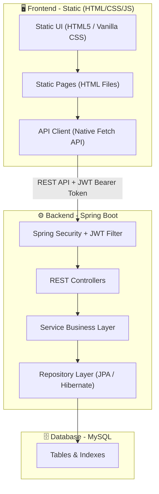

# 🏇 Horse Racing Tournament Management System

## 📋 Giới thiệu Dự án

Dự án **Hệ thống Quản lý Giải Đua Ngựa (Horse Racing Tournament Management System)** là ứng dụng Web Application được xây dựng cho môn học **Lập trình Java / Phát triển Ứng dụng Web**. Hệ thống hỗ trợ toàn diện quy trình đăng ký ngựa, tổ chức các cuộc đua giải đấu, chấm điểm kết quả từ trọng tài, đặt cược ảo từ khán giả và báo cáo doanh thu tự động.

---

## 🏗️ Kiến trúc Hệ thống

Hệ thống được phát triển theo mô hình tách biệt hoàn toàn giữa **Backend API** và **Frontend SPA**:



---

## ⚙️ Tech Stack & Môi trường chạy

| Thành phần | Công nghệ | Phiên bản |
| :--- | :--- | :--- |
| **Backend Core** | Java Spring Boot | 3.x (Java 17+) |
| **Bảo mật & Auth** | Spring Security + JWT | Standard |
| **Database** | MySQL | 8.0 |
| **Tài liệu API** | Swagger UI / OpenAPI 3.0 | 2.4.0 |
| **Frontend Web** | Static HTML5 / CSS3 / JS | Vanilla CSS + Native Fetch API |
| **API Client** | Axios | Tích hợp JWT Interceptor |
| **Containerization**| Docker & Docker Compose | Môi trường deploy |

---

## 📡 Quy định Thiết kế API (API Design Conventions)

Để đảm bảo các bạn **BE** và **FE** làm việc song song hiệu quả mà không bị lệch pha, cả nhóm thống nhất tuân thủ quy chuẩn thiết kế API chung như sau:

### 1. Thông tin chung

* **Base URL**: `http://localhost:8080/api`
* **Định dạng dữ liệu**: Luôn sử dụng `application/json` cho cả Request Body và Response Body.
* **Quy tắc đặt tên URI (URI Naming)**:
  * Sử dụng danh từ số nhiều (ví dụ: `/horses`, `/tournaments` thay vì `/getHorse`, `/createTournament`).
  * Sử dụng chữ thường và định dạng `kebab-case` cho các đường dẫn phức tạp (ví dụ: `/api/auth/refresh-token`).

### 2. Quy chuẩn HTTP Methods & Status Codes

* `GET` (Status `200 OK`): Truy vấn dữ liệu (Tuyệt đối không thay đổi trạng thái database).
* `POST` (Status `201 Created`): Tạo mới dữ liệu.
* `PUT` (Status `200 OK`): Cập nhật toàn bộ thông tin của đối tượng.
* `DELETE` (Status `200 OK` hoặc `204 No Content`): Xóa dữ liệu.

### 3. Quy chuẩn Định dạng Dữ liệu phản hồi (Response Format)

Tất cả các API được bọc chung bởi một cấu trúc `ApiResponse` thống nhất:

#### A. Phản hồi Thành công (Success Response)

```json
{
  "success": true,
  "message": "Thao tác thành công",
  "data": {
    "id": 1,
    "name": "Bạch Mã",
    "breed": "Thoroughbred"
  },
  "timestamp": "2026-05-27T12:00:00Z"
}
```

#### B. Phản hồi Phân trang (Paginated Response)

Dành riêng cho các API lấy danh sách lớn cần chia trang để tối ưu hóa hiệu năng:

```json
{
  "success": true,
  "message": "Lấy danh sách thành công",
  "data": {
    "content": [
      { "id": 1, "name": "Bạch Mã" },
      { "id": 2, "name": "Xích Thố" }
    ],
    "page": 0,
    "size": 10,
    "totalElements": 50,
    "totalPages": 5,
    "last": false
  },
  "timestamp": "2026-05-27T12:00:00Z"
}
```

#### C. Phản hồi Thất bại / Lỗi (Error Response)

Khi có lỗi nghiệp vụ hoặc validation đầu vào:

```json
{
  "success": false,
  "message": "Dữ liệu đầu vào không hợp lệ",
  "errors": [
    {
      "field": "email",
      "message": "Email đã tồn tại trên hệ thống"
    }
  ],
  "timestamp": "2026-05-27T12:00:00Z"
}
```

### 4. Quy định Bảo mật & Xác thực (Authorization)

* Mọi API nghiệp vụ (trừ `/auth/register` và `/auth/login`) đều yêu cầu xác thực qua token JWT.
* FE đính kèm token vào Header của request theo quy chuẩn:

    ```
    Authorization: Bearer <jwt-token>
    ```

* Khi token hết hạn, Backend trả về mã lỗi `401 Unauthorized`. FE cần tự động gọi API refresh token để lấy token mới.

---

## 👥 Phân chia Công việc Nhóm (5 thành viên: 1 FE + 4 BE)

Dự án được tổ chức theo cấu trúc chuyên môn hóa cao để phát huy tối đa thế mạnh của từng thành viên:

| Thành viên | Vai trò | Mô tả nghiệp vụ | Phạm vi công việc |
| :--- | :--- | :--- | :--- |
| **TV1 (Nhóm trưởng)** | BE Lead & DevOps | Cấu hình khung xương, Bảo mật & hạ tầng | Khởi tạo base project, Cấu hình Spring Security + JWT (5 roles: `ADMIN`, `HORSE_OWNER`, `JOCKEY`, `REFEREE`, `SPECTATOR`), Exception Handling tập trung, Swagger, Docker Compose, Review Pull Request. |
| **TV2** | BE Developer | Quản lý Ngựa & Chủ ngựa | Thực thể JPA, JPA Repositories và DTOs cho `User` (Jockey), `Horse` (Ngựa). Nghiệp vụ CRUD cho Ngựa đua và Jockey, bộ lọc/tìm kiếm ngựa đua nâng cao, lịch sử thi đấu của ngựa/nài. |
| **TV3** | BE Developer | Tổ chức giải đấu & Đăng ký | Thực thể JPA, JPA Repositories và DTOs cho `Tournament` (Giải đấu), `Race` (Cuộc đua), `Registration` (Đăng ký). Nghiệp vụ CRUD Giải đấu & Cuộc đua, logic đăng ký giải đấu (Chủ ngựa đăng ký ngựa + chọn Jockey), kiểm tra ràng buộc trùng lịch. |
| **TV4** | BE Developer | Nghiệp vụ Đua, Cược & Báo cáo| Thực thể JPA, JPA Repositories và DTOs cho `RaceResult` (Kết quả), `Bet` (Đặt cược), `Prize` (Giải thưởng), `RevenueReport` (Doanh thu). Nghiệp vụ nhập KQ (Trọng tài), đặt cược ảo (Khán giả), tự động tính odds, phát thưởng tự động, thống kê và kết xuất báo cáo doanh thu. |
| **TV5** | FE Developer | Frontend Web App | Xây dựng toàn bộ giao diện tĩnh bằng HTML5 & Vanilla CSS, gọi API bằng Fetch client có đính kèm token tự động, xử lý bảo vệ trang theo Role bằng JavaScript thuần, thiết kế các phân hệ Dashboard (Admin, Chủ ngựa, Trọng tài, Khán giả) và tích hợp API. |

---

## 📁 Cấu trúc Thư mục Repository (Project Skeleton)

Kho lưu trữ của dự án được cấu trúc rõ ràng để các thành viên BE và FE phát triển song song độc lập:

```
java-horse-racing/
├── .github/                             # 🛠️ Quy trình GitHub
│   ├── PULL_REQUEST_TEMPLATE.md         # Template mẫu để review code khi tạo PR
│   └── ISSUE_TEMPLATE/                  # Mẫu báo cáo lỗi và đề xuất tính năng
│       ├── bug_report.md
│       └── feature_request.md
│
├── backend/                             # ⚙️ Dự án Spring Boot API
│   ├── pom.xml                          # Quản lý thư viện phụ thuộc Maven
│   ├── Dockerfile                       # Container hóa Backend
│   └── src/main/java/com/horseracing/
│       ├── HorseRacingApplication.java  # Lớp chạy ứng dụng Spring Boot
│       ├── config/                      # Cấu hình Spring Security (TV1)
│       ├── security/                    # Bộ lọc xác thực JWT (TV1)
│       ├── model/                       # JPA Entities (TV2, TV3, TV4)
│       ├── repository/                  # JPA Repositories (TV2, TV3, TV4)
│       ├── service/                     # Lớp nghiệp vụ logic (TV2, TV3, TV4)
│       ├── controller/                  # Lớp REST Controllers (TV2, TV3, TV4)
│       ├── dto/                         # DTOs request/response (TV2, TV3, TV4)
│       └── exception/                   # Xử lý lỗi tập trung (TV1)
│
├── frontend/                            # 🖥️ Dự án Frontend Tĩnh (HTML/CSS/JS)
│   ├── Dockerfile                       # Cấu hình container Nginx để phục vụ static files
│   ├── css/                             # Thư mục chứa các file stylesheet CSS thuần
│   │   └── style.css                    # File CSS chính định nghĩa style cho toàn hệ thống
│   ├── js/                              # Thư mục chứa các file mã nguồn JavaScript tĩnh
│   │   └── app.js                       # Xử lý gọi API và render dữ liệu động
│   ├── index.html                       # Giao diện Trang chủ (Landing Page)
│   └── login.html                       # Giao diện Đăng nhập hệ thống
│
├── docs/                                # 📄 Tài liệu đặc tả & thiết kế
│   ├── api-spec.md                      # Đặc tả API endpoints (API Contract)
│   ├── database-schema.md               # Thiết kế Database Schema & ER Diagram
│   ├── CONTRIBUTING.md                  # Hướng dẫn Git workflow & Quy định code
│   ├── TASKS.md                         # Bảng phân chia công việc chi tiết
│   └── init.sql                         # Script DDL SQL khởi tạo dữ liệu MySQL ban đầu
│
├── .gitignore                           # Git ignore chuẩn hóa cho Java & Next.js
└── docker-compose.yml                   # Khởi chạy đồng bộ hệ thống (MySQL + BE + FE)
```

---

## 🤝 Quy trình Phối hợp Làm việc Nhóm qua Git (Git Workflow)

Để đảm bảo code tích hợp không bị xung đột, toàn bộ nhóm thống nhất tuân thủ quy trình Git chuyên nghiệp sau:

### 1. Phân nhánh phát triển (Branching Strategy)

Chúng ta áp dụng mô hình **Feature Branch Workflow** với 2 nhánh chính trên GitHub:

* `main`: Nhánh chạy ổn định ở môi trường production. **Tuyệt đối không commit trực tiếp**. Chỉ merge từ develop qua Pull Request của Nhóm trưởng.
* `develop`: Nhánh tích hợp code phát triển chung của nhóm. Tất cả thành viên sẽ merge code của mình vào đây. **Tuyệt đối không commit trực tiếp**.

### 2. Luồng làm việc của các thành viên hằng ngày

Khi thực hiện bất kỳ nhiệm vụ nào được phân chia (ví dụ: tạo bảng Ngựa):

```bash
# Bước 1: Trở về nhánh chung develop và cập nhật code mới nhất từ GitHub
git checkout develop
git pull origin develop

# Bước 2: Tạo một nhánh tính năng mới (Feature branch) từ develop
# Cú pháp đặt tên nhánh: feature/be-<module> hoặc feature/fe-<page>
git checkout -b feature/be-horse-entity

# Bước 3: Thực hiện code trên nhánh vừa tạo. Commit code nhỏ và rõ ràng
# Commit tuân thủ quy tắc Conventional Commits: feat(scope): message hoặc fix(scope): message
git add .
git commit -m "feat(horse): implement JPA entity for Horse table"

# Bước 4: Đẩy nhánh tính năng lên GitHub
git push origin feature/be-horse-entity
```

### 3. Tạo Pull Request & Code Review

* Sau khi tính năng chạy ổn định ở Local, truy cập GitHub Repo nhóm.
* Tạo một **Pull Request (PR)** yêu cầu merge từ nhánh `feature/be-horse-entity` của bạn vào nhánh `develop`.
* Gán **Reviewers** là Nhóm trưởng (TV1).
* Nhóm trưởng tiến hành kiểm tra code theo checklist dự án. Sau khi duyệt (**Approve**), code sẽ được tự động merge vào `develop`.

---

## 🚀 Hướng dẫn Chạy thử Dự án ở Local

### Cách 1: Chạy từng dịch vụ thủ công

#### 1. Khởi chạy Database MySQL

* Tạo cơ sở dữ liệu `horse_racing_db` trong MySQL local của bạn.
* Khởi chạy và import script tại file `docs/init.sql` để tạo toàn bộ bảng dữ liệu, khóa ngoại, indexes và dữ liệu admin mặc định.

#### 2. Khởi chạy Backend (Spring Boot)

* Cấu hình cổng và mật khẩu kết nối database local của bạn trong `backend/src/main/resources/application-dev.yml` (mặc định cấu hình đang kết nối user `root`, password `root123`).

```bash
cd backend
mvn spring-boot:run -Dspring-boot.run.profiles=dev
```

* Backend API chạy tại: `http://localhost:8080/api`
* Tài liệu Swagger UI: `http://localhost:8080/swagger-ui.html`

#### 3. Khởi chạy Frontend (Static HTML/CSS/JS)

* Sử dụng trình soạn thảo VS Code và cài đặt extension **Live Server**.
* Click chuột phải vào file `frontend/index.html` và chọn **Open with Live Server**.
* Giao diện tĩnh chạy tại địa chỉ mặc định của Live Server (ví dụ: `http://127.0.0.1:5500/frontend/index.html`).

---

### Cách 2: Khởi chạy đồng bộ bằng Docker Compose

Nếu máy tính của bạn đã cài đặt Docker Desktop, bạn có thể khởi chạy toàn bộ dự án đồng bộ (gồm Database MySQL + Spring Boot API + Static FE qua Nginx) chỉ với một dòng lệnh duy nhất tại thư mục gốc dự án:

```bash
docker-compose up -d
```

Hệ thống sẽ tự động build, liên kết mạng và chạy tất cả các dịch vụ đồng bộ tuyệt vời! Giao diện tĩnh sẽ được Nginx phục vụ trực tiếp tại địa chỉ `http://localhost:3000`.

---
*Chúc cả nhóm hoàn thành xuất sắc dự án và đạt kết quả tốt nhất trong môn học!* 🏇🚀
